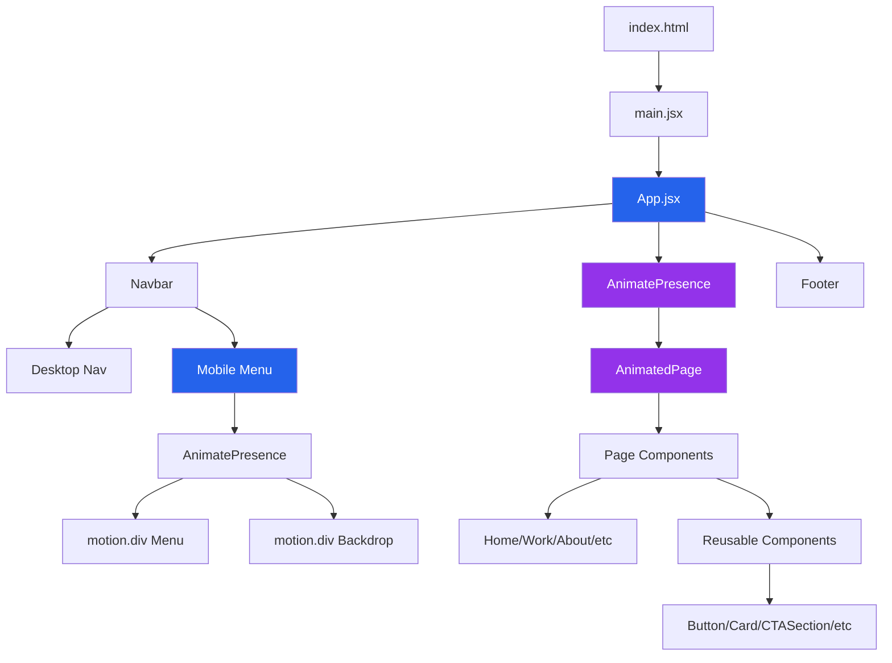
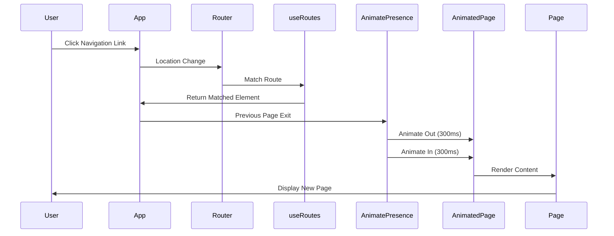
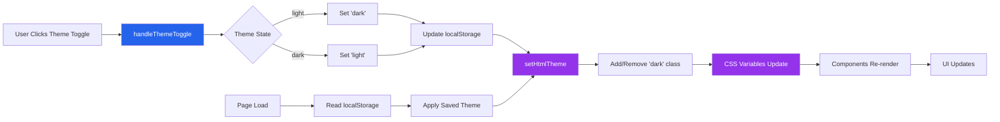

# Architecture Overview

This document describes the high-level architecture of the portfolio application.

## Technology Stack

### Frontend Framework
- **React 19.2.0**: Modern React with hooks, Suspense, and concurrent features
- **Vite 7.2.2**: Build tool with HMR, fast dev server, optimized production builds
- **React Router v7.6.3**: Client-side routing with lazy loading support
- **Framer Motion 12.23.24**: Animation library for smooth page transitions and component animations

### Styling
- **Tailwind CSS 3.4.3**: Utility-first CSS framework
- **PostCSS 8.5.6**: CSS processing and autoprefixing
- **Dark Mode**: `darkMode: 'class'` strategy for theme switching

### Development Tools
- **ESLint 9.29.0**: Code linting with React-specific rules
- **Puppeteer 24.29.1**: Browser automation for screenshot capture
- **Node.js 25.2.0**: Runtime environment

### Deployment
- **Static Hosting**: AWS S3 + CloudFront (or Netlify, Vercel, etc.)
- **SPA Routing**: CloudFront Function or custom error pages for route fallback

## High-Level Architecture

### Application Type
- **Single Page Application (SPA)**: All navigation handled client-side
- **Static Site Generation**: Builds to static HTML/CSS/JS files
- **No Server-Side Rendering**: Pure client-side rendering

### Component Hierarchy



### Routing Flow



### Theme System Flow



### Key Architectural Decisions

1. **ESM Modules Only**: All code uses ES Module syntax (`import`/`export`)
2. **Client-Side Routing**: React Router handles all navigation
3. **Route-Based Code Splitting**: All routes except `Home.jsx` are lazy-loaded for 31% bundle reduction (557KB → 383KB)
4. **Page Transitions**: Framer Motion for smooth page transitions with accessibility support
5. **Theme System**: Tailwind `darkMode: 'class'` with localStorage persistence
6. **Typography Pairing**: Inter (headlines) + Source Serif Pro (body)
7. **CSS Custom Properties**: Theme-aware colors via CSS variables
8. **Component Composition**: Reusable components with clear separation of concerns

## Entry Points

### index.html
**Location:** Root directory  
**Purpose:** Root HTML shell with React mount point

**Key Elements:**
- `<div id="root">`: React mount point
- `<script type="module" src="/src/main.jsx">`: React entry point
- Google Fonts links (Inter, Source Serif Pro)
- Google Analytics (`gtag.js`)
- Meta tags (description, viewport, favicon)

**Loads:**
- React entry point (`src/main.jsx`)
- Global CSS (`src/index.css`)

### src/main.jsx
**Purpose:** React entry point, bootstraps React application

**Structure:**
```javascript
import { StrictMode } from 'react'
import { createRoot } from 'react-dom/client'
import './index.css'
import App from './App.jsx'

createRoot(document.getElementById('root')).render(
  <StrictMode>
    <App />
  </StrictMode>,
)
```

**Features:**
- React 19 `createRoot` API
- `StrictMode` for development warnings
- Global CSS import

### src/App.jsx
**Purpose:** Main application component, handles routing, navigation, theme, layout

**Key Responsibilities:**
- Defines all routes using `useRoutes` hook with route array
- Provides navigation bar (desktop + mobile responsive)
- Manages theme state (light/dark) with localStorage
- Wraps all pages in main layout container (`max-w-7xl mx-auto`)
- Implements page transitions via Framer Motion's `AnimatePresence`
- Uses `cloneElement` pattern to add keys for route tracking
- Lazy-loads all routes except `Home.jsx` with `React.lazy()` and `<Suspense>` boundaries
- Uses `PageSkeleton` component for route-specific loading states
- Renders `<Footer />` component

**Routing Pattern:**
- Uses `useRoutes` hook instead of `<Routes>` component
- Each route element wrapped in `<AnimatedPage>` for transitions
- Lazy-loaded routes wrapped in `<Suspense>` with `PageSkeleton` fallback
- `AnimatePresence` with `mode="wait"` ensures exit completes before enter
- `cloneElement` adds `key` prop based on `location.pathname` for tracking

**Routes:**
- `/`: Home page (eagerly loaded - critical path)
- `/work`: Portfolio/work page (lazy-loaded)
- `/about`: About page (lazy-loaded)
- `/education`: Education page (lazy-loaded)
- `/certifications`: Certifications page (lazy-loaded)
- `/publications`: Publications page (lazy-loaded)
- `/contact`: Contact form page (lazy-loaded)
- `/newsletter`: Newsletter page (lazy-loaded)
- `*`: 404 Not Found page (lazy-loaded)

**Theme Management:**
- State: `const [theme, setTheme] = useState(() => localStorage.getItem(THEME_KEY) || 'light')`
- Toggle: `handleThemeToggle()` updates state and `<html>` class
- Persistence: Stores in localStorage key `'theme-preference'`
- Application: `setHtmlTheme()` adds/removes `dark` class on `<html>`

**Navigation:**
- Desktop: Horizontal nav bar with theme toggle
- Mobile: Animated slide-in menu with backdrop overlay
  - Slide-in from right (300ms) with Framer Motion
  - Staggered menu item animations (50ms delay)
  - Body scroll lock when open
  - Respects `prefers-reduced-motion`
- Responsive: Hidden on mobile (`hidden lg:flex`), visible on desktop

## Directory Structure

```
portfolio2/
├── src/
│   ├── App.jsx                    # Main router, nav, theme, layout
│   ├── main.jsx                   # React entry point
│   ├── index.css                  # Global CSS, CSS variables, Tailwind directives
│   ├── pages/                     # Page-level components
│   │   ├── Home.jsx               # Landing page (eagerly loaded)
│   │   ├── Work.jsx               # Portfolio/work page (lazy-loaded)
│   │   ├── About.jsx              # About page (lazy-loaded)
│   │   ├── Education.jsx          # Education page (lazy-loaded)
│   │   ├── Certifications.jsx     # Certifications page (lazy-loaded)
│   │   ├── Publications.jsx       # Publications page (lazy-loaded)
│   │   ├── Contact.jsx            # Contact form page (lazy-loaded)
│   │   ├── Newsletter.jsx         # Newsletter page (lazy-loaded)
│   │   ├── NotFound.jsx           # 404 page (lazy-loaded)
│   │   └── [Topic pages]          # ClassificationPage, ForecastPage, etc.
│   ├── components/                # Reusable UI components
│   │   ├── Button.jsx             # Link-styled button
│   │   ├── Card.jsx               # Reusable card shell
│   │   ├── ImageWithSkeleton.jsx  # Image loader with skeleton
│   │   ├── PageSkeleton.jsx       # Route loading skeleton component
│   │   ├── PageSubtitle.jsx       # Page subtitle component
│   │   ├── CTASection.jsx         # CTA block component
│   │   ├── Footer.jsx             # Global footer
│   │   ├── Layout.jsx             # Layout wrapper
│   │   ├── Background.jsx         # Background layer
│   │   └── sections/              # Feature sections
│   │       ├── IntroSection.jsx
│   │       ├── MLSection.jsx
│   │       └── [Other sections]
│   ├── hooks/                     # Custom React hooks
│   ├── lib/
│   │   └── validators.js         # Zod validation schemas
│   ├── assets/                    # Images, SVGs, posters
│   │   ├── webapps/               # Web app screenshots (16:9)
│   │   ├── research/              # Research SVGs (4:3)
│   │   ├── bi/                    # BI dashboard SVGs (4:3)
│   │   ├── nlp/                   # NLP project SVGs (4:3)
│   │   └── certifications/        # Certification badges (WebP/PNG)
│   └── data/                      # Data helpers
│       └── publicationHelper.js   # Publications data
├── public/                        # Static assets (copied as-is)
│   ├── robots.txt                 # SEO robots file
│   ├── sitemap.xml                # SEO sitemap
│   └── favicon-td.svg             # Favicon
├── scripts/                       # Utility scripts
│   ├── capture-screenshot.mjs     # Puppeteer screenshot utility
│   └── image-audit.mjs            # Image optimization audit
├── docs/                          # Project documentation
├── dist/                          # Production build output (gitignored)
├── index.html                     # Root HTML shell
├── vite.config.js                 # Vite configuration
├── tailwind.config.js             # Tailwind CSS configuration
├── package.json                   # Dependencies and scripts
└── cloudfront-spa-function.js     # CloudFront Function for SPA routing
```

## Routing Flow

### Client-Side Routing

1. **Browser Navigation:** User navigates to `/work` (via link or URL)
2. **React Router:** `useRoutes` hook matches route in routes array
3. **Page Transition:** `AnimatePresence` detects route change via key prop
4. **Exit Animation:** Previous page animates out (opacity fade + slide)
5. **Page Rendering:** New page element is returned from `useRoutes`
6. **Enter Animation:** New page animates in smoothly
7. **Lazy Loading:** For lazy-loaded routes, Suspense shows `PageSkeleton` fallback until chunk loads
8. **No Page Reload:** Client-side navigation, no server request

**Implementation:**
```javascript
// Routes array with AnimatedPage wrappers
const routes = [
  { path: '/', element: <AnimatedPage><Home /></AnimatedPage> },
  { path: '/work', element: <AnimatedPage><Work /></AnimatedPage> },
  // ...
];

// useRoutes returns matched element
const element = useRoutes(routes);

// AnimatePresence tracks route changes via key
<AnimatePresence mode="wait">
  {element && cloneElement(element, { key: location.pathname })}
</AnimatePresence>
```

### Production SPA Routing

1. **Browser Request:** User requests `/work` (or refreshes page)
2. **CloudFront/S3:** Receives request for `/work` path
3. **CloudFront Function:** Rewrites request to `/index.html` (see `cloudfront-spa-function.js`)
4. **S3:** Serves `index.html` file
5. **React Router:** Client-side router matches `/work` and renders `Work` page
6. **No 404:** User sees correct page, not XML error

**Alternative Solutions:**
- CloudFront custom error pages (403/404 → `/index.html` with 200 status)
- S3 website hosting with error document set to `index.html`
- Netlify/Vercel automatic SPA routing support

See `SPA-ROUTING-SETUP.md` for detailed deployment configuration.

## Theming System

### Theme Strategy
- **Tailwind Dark Mode:** `darkMode: 'class'` in `tailwind.config.js`
- **Activation:** Add/remove `dark` class on `<html>` element
- **State Management:** `App.jsx` manages theme state with `useState`
- **Persistence:** Stores preference in localStorage (`'theme-preference'` key)

### Theme Application
```javascript
function setHtmlTheme(theme) {
  const html = document.documentElement;
  if (theme === 'dark') {
    html.classList.add('dark');
  } else {
    html.classList.remove('dark');
  }
}
```

### CSS Variables
**Light Theme:**
- `--color-surface: 248 247 244` (#F8F7F4)
- `--color-card: 250 249 247` (#FAF9F7)
- `--color-border: 229 231 235` (gray-200)
- `--color-muted: 243 244 246` (gray-100)

**Dark Theme:**
- `--color-surface: 17 24 39` (gray-900)
- `--color-card: 31 41 55` (gray-800)
- `--color-border: 55 65 81` (gray-700)
- `--color-muted: 31 41 55` (gray-800)

**Usage:** Mapped to Tailwind colors via `rgb(var(--color-surface) / <alpha-value>)`

See `docs/styling-and-theming.md` for detailed styling guidelines.

## Data Flow & Side Effects

### Contact Form
**Primary Side Effect:** POSTs JSON to external HTTP API

**Flow:**
1. User submits form in `Contact.jsx`
2. react-hook-form validates via zod schema (`src/lib/validators.js`)
3. Field-level validation errors displayed if validation fails
4. If valid, POST request to `VITE_AWS_HTTPAPI_URL` endpoint
5. Success/error handling and UI updates
6. Form resets on successful submission

**Technology:**
- **react-hook-form**: Form state management
- **zod**: Schema-based validation
- **@hookform/resolvers**: Zod resolver integration

**Environment Variable:**
- `VITE_AWS_HTTPAPI_URL`: API endpoint (injected at build time)

**Payload:**
```json
{
  "name": "string (trimmed)",
  "email": "string (trimmed)",
  "message": "string (trimmed)",
  "timestamp": "ISO string",
  "source": "portfolio-contact-form-rhf"
}
```

**See:** `docs/contact-form.md` for detailed form documentation.

### Static Data
**No Backend:** All data is static (hardcoded in components or imported)

**Data Sources:**
- Project data: Hardcoded in `Work.jsx` arrays
- Publication data: `src/data/publicationHelper.js`
- Certification data: Hardcoded in `Certifications.jsx`

## Build & Output

### Build Process
1. **Vite Build:** `npm run build` processes source files
2. **Output:** Static files generated in `dist/` directory
3. **Asset Hashing:** Files are hashed for cache-busting (e.g., `index-a1b2c3.html`)
4. **Optimization:** Code minification, tree-shaking, asset optimization

### Build Output Structure
```
dist/
├── index.html                    # Main HTML file
├── assets/
│   ├── index-[hash].js          # Main JavaScript bundle (383KB, includes Home + shared code)
│   ├── index-[hash].css         # Main CSS bundle
│   ├── Work-[hash].js           # Lazy-loaded Work chunk (39KB)
│   ├── About-[hash].js          # Lazy-loaded About chunk (7KB)
│   ├── Contact-[hash].js        # Lazy-loaded Contact chunk (91KB, includes react-hook-form + zod)
│   ├── Education-[hash].js       # Lazy-loaded Education chunk (20KB)
│   ├── Certifications-[hash].js  # Lazy-loaded Certifications chunk (27KB)
│   ├── Publications-[hash].js   # Lazy-loaded Publications chunk (15KB)
│   ├── Newsletter-[hash].js     # Lazy-loaded Newsletter chunk (13KB)
│   └── NotFound-[hash].js        # Lazy-loaded NotFound chunk (2KB)
│   └── [image]-[hash].png       # Hashed images
└── favicon-td.svg               # Static assets
```

### Deployment
**Target:** Static hosting (AWS S3 + CloudFront, Netlify, Vercel, etc.)

**Requirements:**
- SPA routing support (serve `index.html` for all routes)
- HTTPS enabled
- Proper CORS headers (if using external API)

See `docs/deployment.md` for detailed deployment instructions.

## Performance Considerations

### Code Splitting
- **Route-Based Splitting:** All routes except `Home.jsx` lazy-loaded with `React.lazy()`
- **Routes Lazy-Loaded:** Work, About, Contact, Education, Certifications, Publications, Newsletter, NotFound
- **Suspense Boundaries:** Each route wrapped in `<Suspense>` with `PageSkeleton` fallback
- **Bundle Impact:** 
  - Main bundle: 383KB (121.58KB gzipped) - down from 557KB (164.93KB gzipped)
  - **31% reduction** in initial bundle size
  - Route chunks: 2-92KB each (loaded on-demand)
- **Performance:** Faster initial load, improved Core Web Vitals (LCP, FID)

### Tailwind Optimization
- **JIT Mode:** Only used classes are included in build
- **Content Configuration:** `content` globs in `tailwind.config.js` specify which files to scan
- **Purge Unused:** Unused CSS automatically removed in production

### Image Optimization
- **Format Selection:** WebP for certifications, SVG for posters where possible
- **Sizing:** Appropriate dimensions for display (no oversized images)
- **Lazy Loading:** `ImageWithSkeleton` component shows placeholder during load

### Asset Caching
- **Hashed Filenames:** Vite hashes assets for cache-busting
- **Browser Caching:** Static assets cached aggressively
- **Cache Invalidation:** Invalidate `index.html` on deployments

## Security Considerations

### Client-Side Security
- **No Secrets:** Environment variables are public (prefixed with `VITE_`)
- **XSS Protection:** React escapes content by default
- **Form Validation:** Client-side validation + server-side validation required

### Contact Form Security
- **Honeypot Field:** Hidden `honey` field for spam detection
- **CORS:** Backend API must allow CORS from site origin
- **Rate Limiting:** Backend should implement rate limiting
- **Input Sanitization:** Backend should sanitize inputs

## Browser Support

### Supported Browsers
- Modern browsers (Chrome, Firefox, Safari, Edge)
- Mobile browsers (iOS Safari, Chrome Mobile)
- No IE11 support (uses modern JavaScript features)

### Feature Detection
- CSS Grid (used for layouts)
- CSS Variables (used for theming)
- ES Modules (used for imports)
- Fetch API (used for form submission)

## Development Workflow

### Local Development
```bash
npm install          # Install dependencies
npm run dev          # Start dev server (HMR enabled)
npm run build        # Build for production
npm run preview      # Preview production build locally
npm run lint         # Run ESLint
```

### Hot Module Replacement (HMR)
- **Fast Refresh:** React components update without full page reload
- **CSS Updates:** Tailwind classes update instantly
- **Asset Updates:** Images update on change

### Environment Variables
- **Local:** Create `.env` file at project root
- **Production:** Set in build/CI environment
- **Naming:** Must be prefixed with `VITE_` to be exposed to client

See `docs/getting-started.md` for detailed setup instructions.

## Future Architecture Considerations

### Potential Enhancements
- **TypeScript:** Migrate to TypeScript for type safety
- **Testing:** Add unit tests (Vitest) and E2E tests (Playwright)
- **SSR/SSG:** Consider Next.js for server-side rendering
- **CMS Integration:** Add headless CMS for content management
- **PWA:** Add service worker and manifest for offline support
- **i18n:** Add internationalization support

### Known Limitations
- **No Server-Side Rendering:** Pure client-side SPA
- **Static Content Only:** No dynamic content from database
- **No User Accounts:** No authentication/user management
- **SEO:** Limited SEO compared to SSR (mitigated with meta tags)


