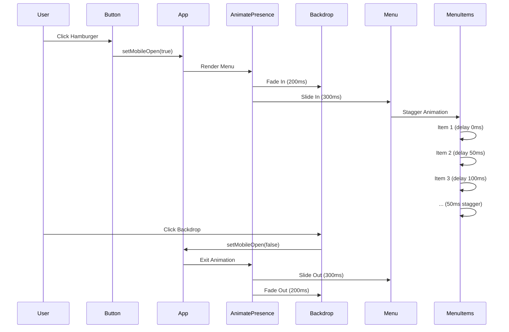

# Page Transitions

This document describes the page transition implementation using Framer Motion.

## Overview

The portfolio uses Framer Motion 12.23.24 for smooth animations including:
- **Page transitions** between routes
- **Mobile navigation** slide-in menu
- **Component animations** throughout the app

All animations respect accessibility preferences and provide a professional, polished user experience.

## Implementation

### Pattern: `useRoutes` + `cloneElement` + `AnimatePresence`

This pattern is recommended for React Router v6+ with Framer Motion:

1. **Routes Array:** Each route element wrapped in `<AnimatedPage>`
2. **useRoutes Hook:** Returns matched element for current location
3. **cloneElement:** Adds `key` prop based on `location.pathname` for tracking
4. **AnimatePresence:** Manages exit/enter animations with `mode="wait"`

### App.jsx Implementation

```javascript
import { useRoutes, useLocation } from 'react-router-dom';
import { cloneElement } from 'react';
import { AnimatePresence } from 'framer-motion';
import AnimatedPage from './components/AnimatedPage';

function AppContent() {
  const location = useLocation();
  
  // Define routes with AnimatedPage wrappers
  const routes = [
    {
      path: '/',
      element: (
        <AnimatedPage>
          <Home />
        </AnimatedPage>
      ),
    },
    {
      path: '/work',
      element: (
        <AnimatedPage>
          <Suspense fallback={/* ... */}>
            <Work />
          </Suspense>
        </AnimatedPage>
      ),
    },
    // ... other routes
  ];

  // Get matched route element
  const element = useRoutes(routes);

  return (
    <main>
      <AnimatePresence mode="wait" initial={false}>
        {element && cloneElement(element, { key: location.pathname })}
      </AnimatePresence>
    </main>
  );
}
```

## AnimatedPage Component

**Location:** `src/components/AnimatedPage.jsx`

**Purpose:** Wrapper component that applies page transition animations

### Features

1. **Accessibility Support:**
   - Detects `prefers-reduced-motion` preference on mount
   - Listens for changes to motion preference dynamically
   - Switches between reduced and full motion animations

2. **Animation Variants:**
   - **Full Motion:** Slide (20px) + fade
     - Enter: `opacity: 0, x: 20` → `opacity: 1, x: 0`
     - Exit: `opacity: 1, x: 0` → `opacity: 0, x: -20`
   - **Reduced Motion:** Fade only
     - Enter: `opacity: 0` → `opacity: 1`
     - Exit: `opacity: 1` → `opacity: 0`

3. **Timing:**
   - Full motion: 300ms duration
   - Reduced motion: 150ms duration
   - Custom easing: `[0.22, 1, 0.36, 1]` (cubic-bezier)

### Usage

```javascript
// In routes array
{
  path: '/work',
  element: (
    <AnimatedPage>
      <Work />
    </AnimatedPage>
  ),
}
```

### Implementation Details

```javascript
const AnimatedPage = ({ children }) => {
  const [shouldReduceMotion, setShouldReduceMotion] = useState(false);

  useEffect(() => {
    const mediaQuery = window.matchMedia('(prefers-reduced-motion: reduce)');
    setShouldReduceMotion(mediaQuery.matches);

    const handleChange = (e) => setShouldReduceMotion(e.matches);
    mediaQuery.addEventListener('change', handleChange);
    return () => mediaQuery.removeEventListener('change', handleChange);
  }, []);

  // Choose animations based on preference
  const animations = shouldReduceMotion 
    ? reducedMotionAnimations 
    : fullMotionAnimations;

  return (
    <motion.div
      variants={animations}
      initial="initial"
      animate="animate"
      exit="exit"
      transition={{ 
        duration: shouldReduceMotion ? 0.15 : 0.3,
        ease: [0.22, 1, 0.36, 1]
      }}
    >
      {children}
    </motion.div>
  );
};
```

## How It Works

### Transition Flow

1. **User Navigation:** User clicks link to `/work`
2. **Route Matching:** `useRoutes` matches `/work` in routes array
3. **Element Returned:** Returns `<AnimatedPage><Work /></AnimatedPage>`
4. **Key Detection:** `cloneElement` adds `key="/work"` to element
5. **AnimatePresence:** Detects key change from previous route
6. **Exit Animation:** Previous page animates out (300ms)
7. **Enter Animation:** After exit completes (`mode="wait"`), new page animates in (300ms)

### Why `mode="wait"`

The `mode="wait"` prop ensures:
- Exit animation completes before enter animation starts
- No overlapping animations
- Smoother, more predictable transitions
- Better performance (one animation at a time)

### Why `initial={false}`

The `initial={false}` prop prevents:
- Animation on first page load
- Unnecessary animation when user first visits site
- Only animates on subsequent route changes

### Why `cloneElement`

The `cloneElement` pattern:
- Adds `key` prop to element returned by `useRoutes`
- Allows `AnimatePresence` to track route changes
- Required because `useRoutes` doesn't provide keys by default

## Accessibility

### Reduced Motion Support

The implementation fully respects `prefers-reduced-motion`:

1. **Detection:** Checks preference on component mount
2. **Dynamic Updates:** Listens for preference changes
3. **Adaptive Animations:**
   - Reduced motion: Fade only (150ms)
   - Full motion: Slide + fade (300ms)

**Testing:**
- Enable "Reduce Motion" in OS settings
- Navigate between pages
- Verify only fade occurs (no slide)

## Performance Considerations

### Bundle Size
- **Framer Motion:** ~60-80KB gzipped
- **Impact:** Acceptable tradeoff for UX improvement
- **Optimization:** Only imports needed functions (`motion`, `AnimatePresence`)

### Animation Performance
- **GPU Acceleration:** Framer Motion uses transform/opacity (GPU-accelerated)
- **Duration:** 300ms is optimal (fast enough to feel responsive, slow enough to be smooth)
- **Easing:** Custom easing provides natural motion

### Best Practices
- Keep animations subtle (20px slide is barely noticeable but adds polish)
- Respect user preferences (reduced motion)
- Test on slower devices
- Avoid animating too many elements simultaneously

## Common Issues

### Transitions Not Working
**Symptoms:** Pages change instantly without animation

**Causes:**
- `AnimatePresence` not wrapping `useRoutes` result
- Missing `key` prop on element
- `mode="wait"` not set
- Routes not wrapped in `<AnimatedPage>`

**Solutions:**
- Verify `AnimatePresence` wraps the `cloneElement` result
- Ensure `cloneElement` adds `key={location.pathname}`
- Check all routes are wrapped in `<AnimatedPage>`

### Animation Too Slow/Fast
**Symptoms:** Transitions feel sluggish or jarring

**Solutions:**
- Adjust duration in `AnimatedPage.jsx` (currently 300ms)
- Try 250ms for faster feel
- Try 350ms for slower feel
- Keep between 200-400ms for best UX

### Reduced Motion Not Working
**Symptoms:** Animations still slide even with reduced motion enabled

**Solutions:**
- Check browser console for errors
- Verify `window.matchMedia` is supported
- Test in browser with reduced motion enabled
- Check `AnimatedPage` component for proper detection

## Adding New Routes

When adding a new route, always wrap it in `<AnimatedPage>`:

```javascript
// ✅ Correct
{
  path: '/new-page',
  element: (
    <AnimatedPage>
      <NewPage />
    </AnimatedPage>
  ),
}

// ❌ Incorrect (no transition)
{
  path: '/new-page',
  element: <NewPage />,
}
```

## Future Enhancements

### Potential Improvements
1. **Different animations per route type:**
   - Fade for Home
   - Slide for Work
   - Scale for About

2. **Stagger animations for lists:**
   - Portfolio cards appearing one by one

3. **Scroll-triggered animations:**
   - Sections fading in as you scroll

4. **Route-specific animations:**
   - Custom transitions based on route direction (back/forward)

## Mobile Navigation Animation

**Location:** `src/App.jsx`

The mobile navigation menu uses Framer Motion for smooth slide-in animations.

### Component Interaction Flow



### Implementation

```javascript
<AnimatePresence>
  {mobileOpen && (
    <>
      {/* Backdrop Overlay */}
      <motion.div
        initial={{ opacity: 0 }}
        animate={{ opacity: 1 }}
        exit={{ opacity: 0 }}
        className="fixed inset-0 bg-black/50 backdrop-blur-sm z-40"
        onClick={() => setMobileOpen(false)}
      />
      
      {/* Mobile Menu */}
      <motion.div
        initial={{ opacity: 0, x: '100%' }}
        animate={{ opacity: 1, x: 0 }}
        exit={{ opacity: 0, x: '100%' }}
        transition={{ duration: 0.3, ease: [0.22, 1, 0.36, 1] }}
        className="fixed top-0 right-0 bottom-0 w-64 bg-white shadow-2xl z-50"
      >
        {/* Menu items with stagger */}
      </motion.div>
    </>
  )}
</AnimatePresence>
```

### Features

1. **Slide-in Animation:**
   - Menu slides in from right (`x: '100%'` → `x: 0`)
   - 300ms duration with custom easing
   - Backdrop fades in simultaneously (200ms)

2. **Staggered Menu Items:**
   - Menu items animate in sequence (50ms delay between items)
   - Each item fades in and slides from right (20px)
   - Creates polished, professional feel

3. **Accessibility:**
   - Respects `prefers-reduced-motion` (fade-only when enabled)
   - Body scroll lock when menu is open
   - Close button and backdrop click to dismiss

4. **UX Enhancements:**
   - Fixed positioning with proper z-index layering
   - Backdrop blur for visual depth
   - Smooth exit animation when closing

### Animation Details

- **Full Motion:**
  - Menu slide: 300ms
  - Backdrop fade: 200ms
  - Item stagger: 50ms delay
  - Item animation: 200ms (fade + slide)

- **Reduced Motion:**
  - Menu fade: 150ms (no slide)
  - Backdrop fade: 100ms
  - No stagger (items appear simultaneously)
  - Item animation: 100ms (fade only)

## See Also

- `docs/routing-and-navigation.md`: Routing patterns and navigation
- `docs/pages-and-components.md`: AnimatedPage component API and App.jsx details
- `docs/architecture.md`: Overall architecture including page transitions
- [Framer Motion Documentation](https://www.framer.com/motion/)

---

**Last Updated:** 2025-01-11

